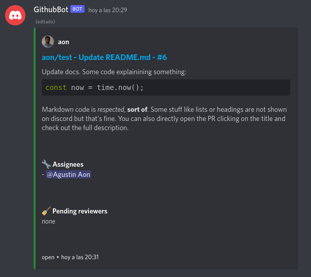
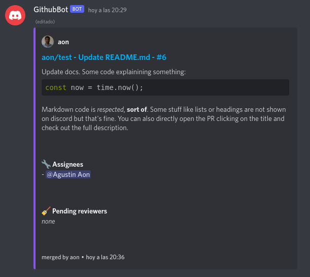

# PR Tracker Discord Bot

I've built this bot to satisfy a very particular need we had with my team: track our PRs on Discord.

## Showcase

So why not show how PRs are tracked?



And when it's merged:



The slash commands will quickly help you understand how to use this bot: just register the repos/organizations you'll be listening to and you're ready to go! If you'd like, you can instruct your team to register your discord user so that it pings you anytime you're assigned as reviewer or assignee.

## Functions

So as you can see, this bot lets you:

- Keep track of PRs in multiple repositories and organizations per channel
- Print all related data including description in full markdown, assigness left, reviewers, PR status and author
- Mention users that had registered their github account

## Deploying

If you're sold this far and want to try it on your own, this is self-hosted, so you'll need: a database and somewhere to host it, with a public and static url so that github can point to for sending PRs data.

Then you can just run it with:

```
docker run -d \
  -p 8080:8080 \
  -e DISCORD_TOKEN=<discord-token>  \
  -e DISCORD_CLIENT_ID=<discord-client-id>  \
  -e DATABASE_URL=<database-url>  \
  -e SERVER_URL=<server-url>  \
  -e GITHUB_SECRET=<github-secret>  \
  --name pr-tracker-discord-bot \
  --restart unless-stopped \
  agustinaon/pr-tracker-discord-bot
```

or with docker-compose:

```yaml
version: "3.7"

services:
  pr-tracker-discord-bot:
    container_name: pr-tracker-discord-bot
    image: agustinaon/pr-tracker-discord-bot:main
    restart: unless-stopped
    environment:
      - DISCORD_TOKEN=<discord-token>
      - DISCORD_CLIENT_ID=<discord-client-id>
      - SERVER_URL=<server-url>
      - DATABASE_URL=<database-url>
      - GITHUB_SECRET=<github-secret>
    ports:
      - 8080:8080
```

Brief explanation on environment variables:
- `DISCORD_TOKEN`: token generated once when creating bot
- `DISCORD_CLIENT_ID`: your discord app id
- `SERVER_URL`: the url of where you are hosting this bot, needed just for the /about slash command
- `GITHUB_SECRET`: (optional) set when you want your webhooks to be authenticated
